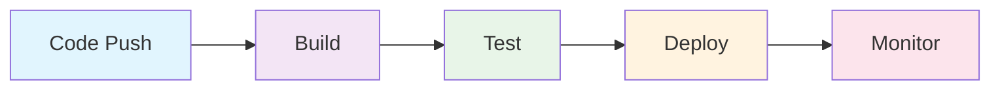
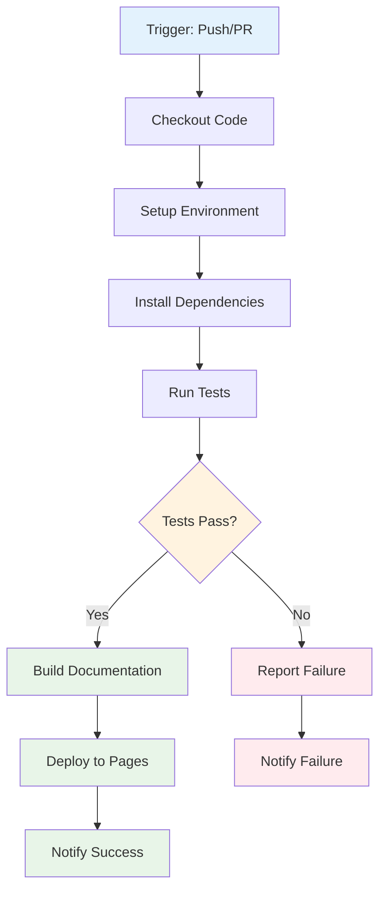
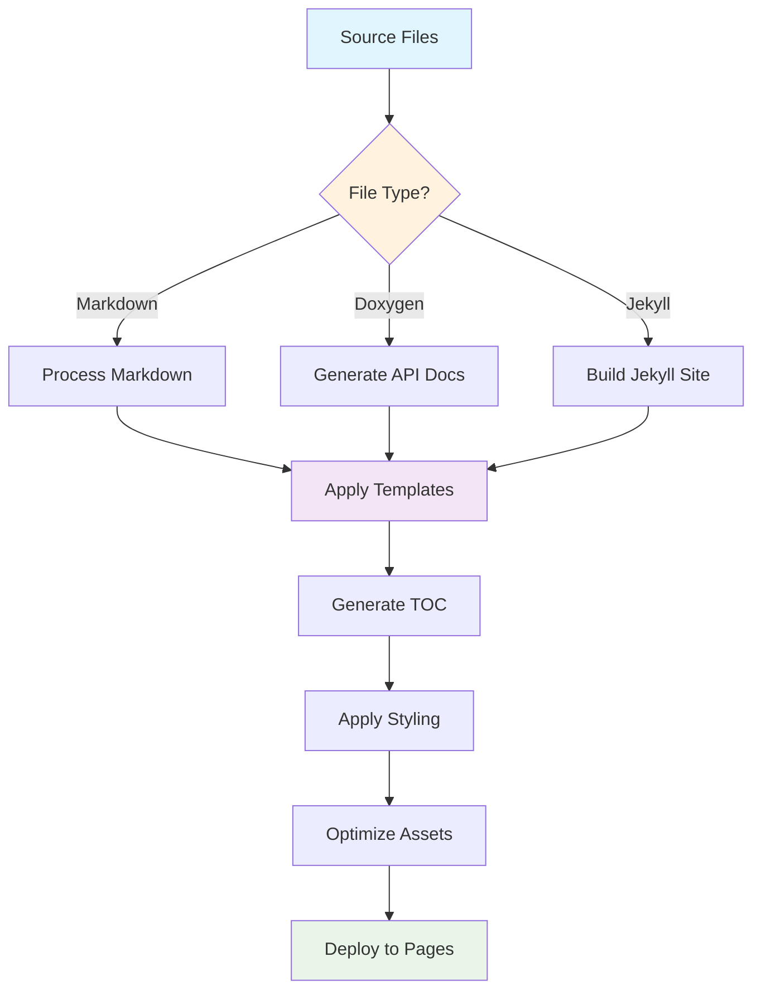
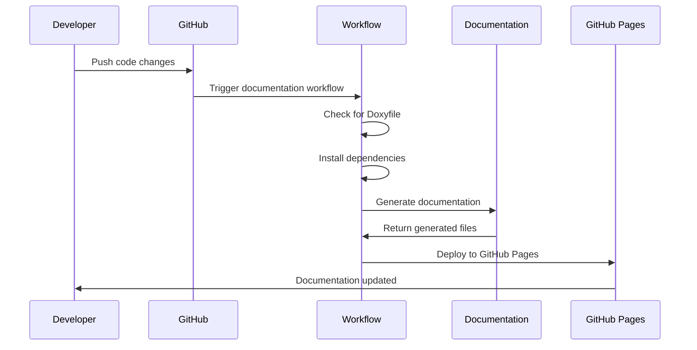
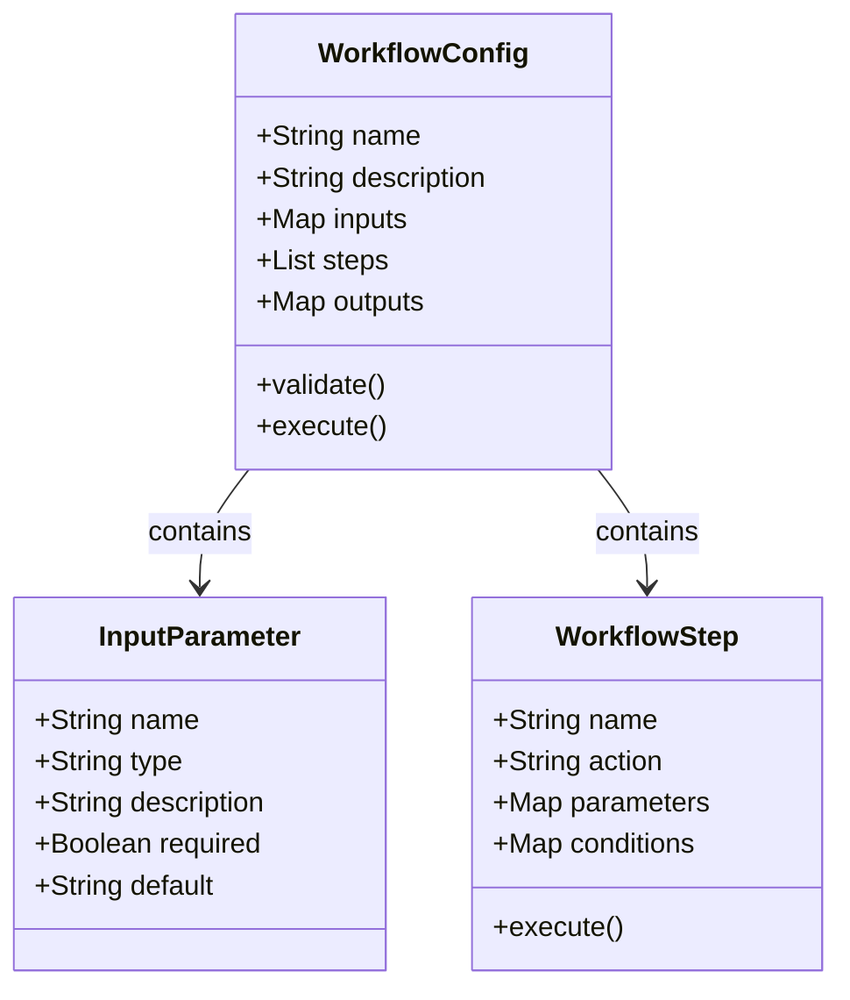
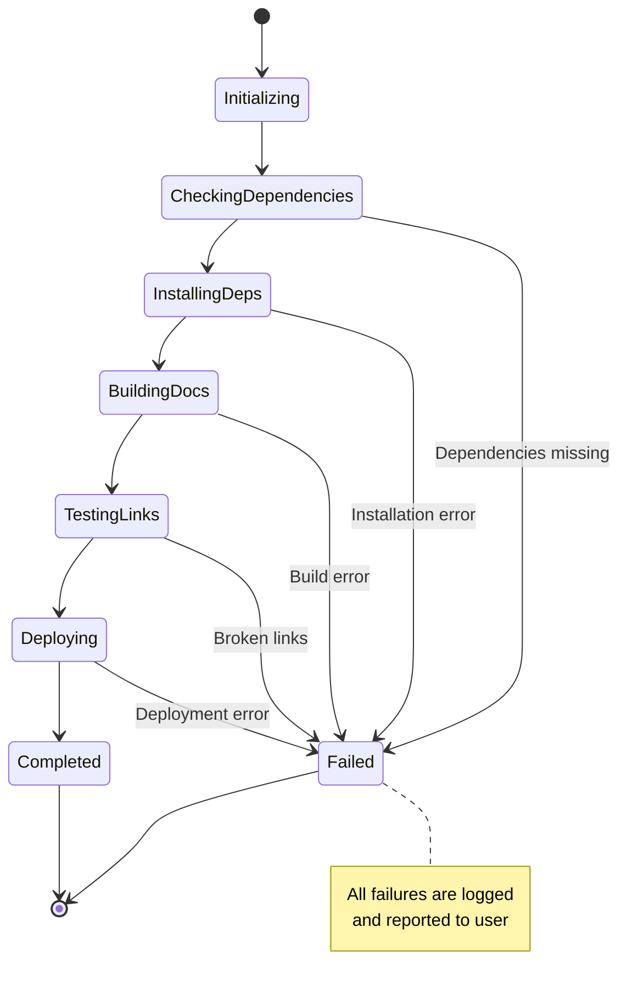
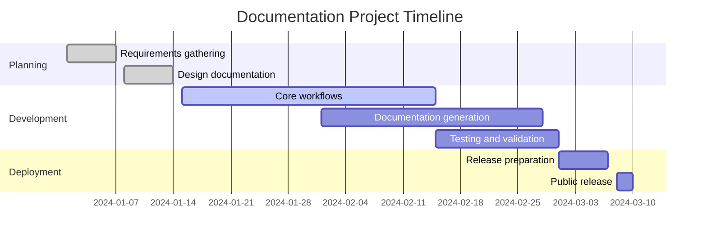
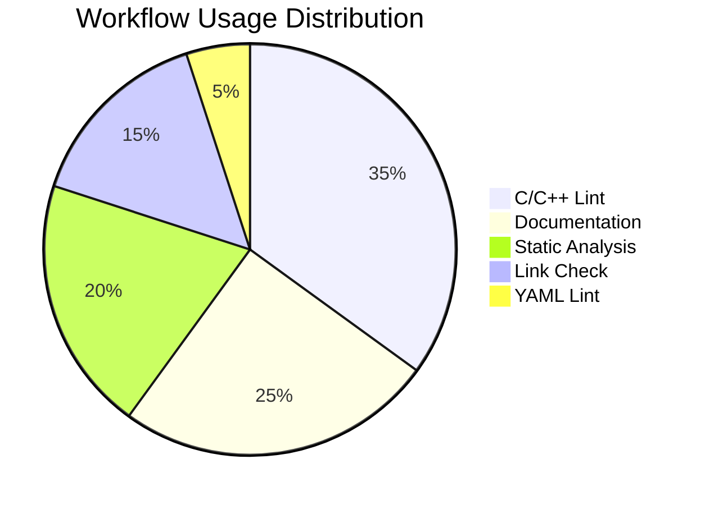

# Mermaid Diagram Examples

This page demonstrates how to use Mermaid diagrams in your documentation to visualize workflows, processes, and relationships.

## Workflow Diagrams

### Basic CI/CD Pipeline



### GitHub Actions Workflow



### Documentation Generation Process



## Sequence Diagrams

### Documentation Workflow Sequence



## Class Diagrams

### Workflow Configuration Structure



## State Diagrams

### Documentation Build States



## Gantt Charts

### Documentation Project Timeline



## Pie Charts

### Workflow Usage Distribution



## Git Graphs

### Repository Branch Structure

```mermaid
gitgraph
    commit id: "Initial commit"
    branch develop
    checkout develop
    commit id: "Add workflows"
    commit id: "Add documentation"
    checkout main
    merge develop
    commit id: "Release v1.0"
    branch feature/docs
    checkout feature/docs
    commit id: "Add Mermaid support"
    commit id: "Enhance styling"
    checkout main
    merge feature/docs
    commit id: "Release v1.1"
```

## Best Practices

### 1. Keep Diagrams Simple
- Use clear, descriptive labels
- Avoid overcrowding with too many elements
- Use consistent styling and colors

### 2. Use Appropriate Diagram Types
- **Flowcharts**: For processes and workflows
- **Sequence Diagrams**: For interactions between components
- **Class Diagrams**: For system architecture
- **State Diagrams**: For state transitions
- **Gantt Charts**: For project timelines

### 3. Consistent Styling
- Use the same color scheme throughout your documentation
- Apply consistent node shapes and sizes
- Use meaningful icons and symbols

### 4. Accessibility
- Provide alternative text descriptions for complex diagrams
- Ensure diagrams are readable in both light and dark modes
- Use high contrast colors for better visibility

## Integration with Just the Docs

The Mermaid diagrams are automatically rendered by the Just the Docs theme when you include them in your markdown files. The diagrams will:

- Automatically adapt to your theme's color scheme
- Be responsive and work on mobile devices
- Support both light and dark modes
- Be included in the search functionality

## Troubleshooting

If your Mermaid diagrams are not rendering:

1. Check that the `jekyll-mermaid` plugin is included in your `_config.yml`
2. Ensure your Mermaid syntax is correct
3. Verify that the diagram is properly enclosed in code blocks with `mermaid` language specification
4. Check the browser console for any JavaScript errors

For more information about Mermaid syntax, visit the [official Mermaid documentation](https://mermaid-js.github.io/mermaid/).
